# MLIR Diagrams: matmul.mlir

Generated from: `matmul.mlir`

> **Note**: To view these diagrams in Cursor/VSCode, install the 'Markdown Preview Mermaid Support' extension.
> Alternatively, open the accompanying `.html` file in a browser.

---

## Dataflow Diagram

```mermaid
---
title: "Detailed Tile Flow - Single Iteration in Core[0,0]"
---
%%{ init: { "theme": "base", "themeVariables": { "primaryColor": "#e8f5e9", "primaryTextColor": "#000", "primaryBorderColor": "#2e7d32", "lineColor": "#666", "secondaryColor": "#f3e5f5", "tertiaryColor": "#fff9c4", "clusterBkg": "#f5f5f5", "clusterBorder": "#666", "edgeLabelBackground": "#ffffff", "fontSize": "18px" }, "flowchart": { "markdownAutoWrap": false, "wrappingWidth": 9999, "nodeSpacing": 60, "rankSpacing": 60 } } }%%
flowchart TD
    subgraph iteration["Processing Iteration"]
        direction TB
        
        subgraph dram["💾 DRAM Global Memory"]
            input_tiles["Input Tiles<br/>From global memory"]
        end
        
        subgraph core_l1["Core[0,0]_L1_Memory_And_Compute"]
            direction TB
            
            subgraph threads["⚡ 3 Concurrent Threads"]
                direction LR
                
                subgraph dm0_flow["🔄 DM0 Thread Flow"]
                    direction TB
                    dm0_1["<b>1️⃣ DMA transfer</b>"]
                    dm0_2["<b>2️⃣ reserve CB</b>"]
                    dm0_1 --> dm0_2
                    dm0_3["<b>3️⃣ semaphore_wait</b>"]
                    dm0_2 --> dm0_3
                    dm0_4["<b>4️⃣ semaphore_set</b>"]
                    dm0_3 --> dm0_4
                    dm0_5["<b>5️⃣ semaphore_inc</b>"]
                    dm0_4 --> dm0_5
                    dm0_6["<b>6️⃣ multicast</b>"]
                    dm0_5 --> dm0_6
                end
                
                subgraph dm1_flow["🔄 DM1 Thread Flow"]
                    direction TB
                    dm1_1["<b>1️⃣ DMA transfer</b>"]
                    dm1_2["<b>2️⃣ reserve CB</b>"]
                    dm1_1 --> dm1_2
                    dm1_3["<b>3️⃣ semaphore_wait</b>"]
                    dm1_2 --> dm1_3
                    dm1_4["<b>4️⃣ semaphore_set</b>"]
                    dm1_3 --> dm1_4
                    dm1_5["<b>5️⃣ semaphore_inc</b>"]
                    dm1_4 --> dm1_5
                    dm1_6["<b>6️⃣ multicast</b>"]
                    dm1_5 --> dm1_6
                end
                
                subgraph compute_flow["⚙️ Compute Thread Flow"]
                    direction TB
                    compute_1["<b>1️⃣ reserve CB</b>"]
                    compute_2["<b>2️⃣ wait CB</b>"]
                    compute_1 --> compute_2
                    compute_3["<b>3️⃣ tile_matmul</b>"]
                    compute_2 --> compute_3
                    compute_4["<b>4️⃣ store to CB</b>"]
                    compute_3 --> compute_4
                end
                
            end
            
            subgraph cbs["📦 L1 Circular Buffers"]
                direction LR
                cb0["CB0<br/>Multiple tile slots<br/>Producer: DM0<br/>Consumer: Compute"]
                cb1["CB1<br/>Multiple tile slots<br/>Producer: DM1<br/>Consumer: Compute"]
                cb2["CB2<br/>Multiple tile slots<br/>Producer: Compute<br/>Consumer: Compute"]
            end
            
            subgraph sync["🚦 Synchronization"]
                direction TB
                sems["<b>Semaphores:</b><br/>• sem0<br/>• sem1<br/>• sem2<br/>• sem3<br/><br/>Flow control and<br/>synchronization"]
            end
        end
    end
    
    %% Data movement connections
    input_tiles ==>|"DMA transfer"| dm0_1
    input_tiles ==>|"DMA transfer"| dm1_1
    
    dm0_2 ==>|"Write tiles"| cb0
    dm1_2 ==>|"Write tiles"| cb1
    compute_1 ==>|"Write tiles"| cb2
    cb0 ==>|"Read tiles"| compute_2
    cb1 ==>|"Read tiles"| compute_2
    cb2 ==>|"Read tiles"| compute_2
    
    %% Synchronization
    sems -.->|"coordinate"| dm0_3
    sems -.->|"coordinate"| dm1_3
    
    %% Styling
    style dram fill:#ffebee,stroke:#c62828,stroke-width:2px
    style core_l1 fill:#f5f5f5,stroke:#424242,stroke-width:4px
    style threads fill:#e8f5e9,stroke:#2e7d32,stroke-width:2px
    style iteration fill:#ffffff,stroke:#666,stroke-width:2px
    style dm0_flow fill:#f3e5f5,stroke:#7b1fa2,stroke-width:3px
    style dm1_flow fill:#f3e5f5,stroke:#7b1fa2,stroke-width:3px
    style compute_flow fill:#e8f5e9,stroke:#388e3c,stroke-width:3px
    style cbs fill:#fff9c4,stroke:#f57f17,stroke-width:3px
    style sync fill:#ffccbc,stroke:#d84315,stroke-width:2px
```

---

## Sequence Diagram

---

## Architecture Diagram

```mermaid
---
title: "D2M Grid Architecture - 2x2 Cores"
---
%%{ init: { "theme": "base", "themeVariables": { "primaryColor": "#e8f5e9", "primaryTextColor": "#000", "primaryBorderColor": "#2e7d32", "lineColor": "#666", "secondaryColor": "#f3e5f5", "tertiaryColor": "#fff9c4", "clusterBkg": "#f5f5f5", "clusterBorder": "#666", "edgeLabelBackground": "#ffffff", "fontSize": "18px" }, "flowchart": { "markdownAutoWrap": false, "wrappingWidth": 9999, "nodeSpacing": 60, "rankSpacing": 60 } } }%%
flowchart LR
    subgraph grid["⚡ Core Grid"]
        direction TB
        
        C00["Core[0,0]<br/>───────<br/>DM0: DMA transfer, reserve CB<br/>DM1: DMA transfer, reserve CB<br/>Compute: reserve CB, wait CB<br/>"]
        C01["Core[0,1]<br/>───────<br/>DM0: DMA transfer, reserve CB<br/>DM1: DMA transfer, reserve CB<br/>Compute: reserve CB, wait CB<br/>"]
        C10["Core[1,0]<br/>───────<br/>DM0: DMA transfer, reserve CB<br/>DM1: DMA transfer, reserve CB<br/>Compute: reserve CB, wait CB<br/>"]
        C11["Core[1,1]<br/>───────<br/>DM0: DMA transfer, reserve CB<br/>DM1: DMA transfer, reserve CB<br/>Compute: reserve CB, wait CB<br/>"]
    end
    
    subgraph memory["💾 Global Memory"]
        INPUT["Input Data"]
    end
    
    INPUT ==>|"DMA"| C00
    
    C00 ==>|"Multicast"| C01
    C00 ==>|"Multicast"| C10
    C00 ==>|"Multicast"| C11
    
    style C00 fill:#d4edda,stroke:#28a745,stroke-width:3px
    style memory fill:#ffe1e1
```

---

