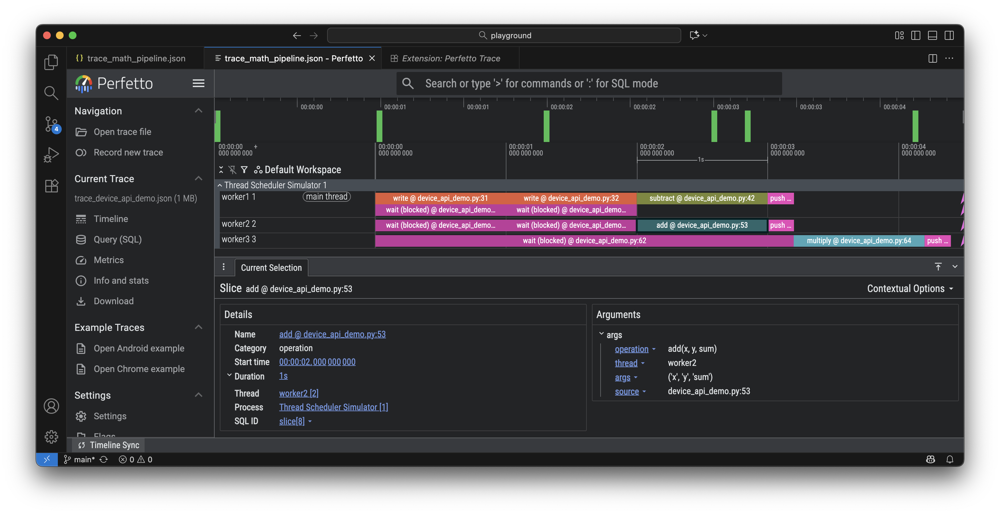

# Thread Scheduler Simulator

Multithreaded multicore device simulator using logical timestamps. Executes in a single Python thread and generates Perfetto-compatible JSON traces.

Requirements: Python 3.10+

## Features

- Operations: wait, write, push, add, multiply, subtract, read
- Configurable number of cores with parallel execution
- Round-robin scheduling
- Address-based memory with availability tracking
- Logical timestamps (default: 1s per operation)
- Perfetto trace generation with source location tracking
- Console output with efficiency statistics
- Two programming styles:
  - **Natural Python syntax** with AST compilation (default)
  - **Explicit Device API**: `dev.write()`, `dev.add()`, etc.
- Decorator-based thread definition
- Iteration-based variable scoping for pipeline parallelism
- Deadlock detection

## Architecture

### Core Components

1. **Memory**: Address-value map with availability tracking (unlimited capacity)
2. **Thread**: Sequence of operations
3. **Scheduler**: Round-robin scheduler managing thread execution
4. **Operations**: 
   - `wait(address)`: Block until data available (preemptible, no overhead)
   - `write(address, value)`: Store literal value (1s, non-preemptible, requires push to make available)
   - `push(address)`: Mark data as available (0.2s, non-preemptible)
   - `add/multiply/subtract(addr1, addr2, dest)`: Compute and store result (1s each, non-preemptible, requires push to make available)

### Scheduling

- The scheduler uses round-robin scheduling among ready threads
- Operations run to completion except for `wait`, which blocks if data is unavailable
- Blocked threads automatically become ready when their data becomes available
- Each operation has a predetermined duration (default: 1 second)


## Usage

Clone the playground repo, e.g., `https://github.com/brnorris03/playground.git`.
No installation required, just run in the `thread_scheduler` directory with python3.

### Running Examples

Run individual examples as Python modules:

```bash
# From the thread_scheduler directory

# Natural Python syntax examples (use AST transformation)
python3 -m examples.math_pipeline
python3 -m examples.ast_complex
python3 -m examples.ast_statistics_pipeline
python3 -m examples.ast_statistics_fused
python3 -m examples.ast_array_pipeline

# Explicit Device API examples
python3 -m examples.producer_consumer
python3 -m examples.multi_consumer
python3 -m examples.parallel_math
python3 -m examples.statistics_pipeline
python3 -m examples.array_pipeline
python3 -m examples.device_api_demo
python3 -m examples.perfect_parallelism
python3 -m examples.deadlock_demo
```

Each example will:
1. Execute the simulation
2. Print console timeline summary with efficiency statistics
3. Generate a trace file in `traces/` subdirectory (created in current working directory)
4. Display final memory state

### Viewing Traces

1. Open [https://ui.perfetto.dev](https://ui.perfetto.dev) or use the VSCode plugin
2. Load trace file from `traces/` subdirectory
3. Timeline shows threads executing "in parallel" using logical timestamps
4. Click on operation boxes to see metadata:
   - **Source location**: Exact line in your Python code (e.g., `math_pipeline.py:30`)
   - **Operation details**: Type, addresses, values
   - **Duration**: Logical time taken
5. Gray semi-transparent blocks indicate wait periods (blocked threads)

### Configuration

Operation durations (in seconds) are defined in `config.py`:

```python
from thread_scheduler import OPERATION_DURATIONS

# View current durations
print(OPERATION_DURATIONS)

# Modify for custom simulations
OPERATION_DURATIONS["add"] = 2.0  # Make addition slower
```

### Creating Custom Simulations

#### Natural Python Syntax (Default)

Use natural Python syntax with automatic AST compilation:

```python
from thread_scheduler import create_simulation, generate_perfetto_trace

# Create simulation
sim = create_simulation(num_cores=2)

# Define threads using natural Python syntax
@sim.thread(name="host")
def host():
    x = 42
    y = 10
    return x, y

@sim.thread(name="worker")
def worker():
    result = x + y
    return result

# Run simulation
events = sim.run()

# Display results
generate_perfetto_trace(events, "my_trace.json")
print(f"result = {sim.get_memory().read('result')}")  # Output: result = 52
```

**How it works:**
- Variables are automatically managed in global scope by default
- Assignments like `x = 42` generate `write(x, 42)` and `push(x)` operations
- Expressions like `result = x + y` generate `wait(x)`, `wait(y)`, `add(x, y, result)`, and `push(result)` operations
- The `read()` function reads external values: `a = read(value)` generates `write(a, value)` and `push(a)`
- Source locations in traces point to your actual Python code lines

**Iteration Scoping:**

For pipeline parallelism with multiple iterations, use the `iteration` parameter to scope variables:

```python
import random
from thread_scheduler import create_simulation, generate_perfetto_trace, read

sim = create_simulation(num_cores=3)
random.seed(42)
input_data = [(random.randint(1, 100), random.randint(1, 100)) for _ in range(10)]

def pipeline(iteration):
    a_val, b_val = input_data[iteration]
    
    @sim.thread(name=f"It{iteration}_reader", iteration=iteration)
    def reader():
        a = read(a_val)  # Becomes iter_0.a, iter_1.a, etc.
        b = read(b_val)
        return a, b
    
    @sim.thread(name=f"It{iteration}_compute", iteration=iteration)
    def compute():
        result = (a + b) * (a - b)  # Uses iter_N.a, iter_N.b
        return result
    
    @sim.thread(name=f"It{iteration}_writer", iteration=iteration)
    def writer():
        output = result  # Uses iter_N.result
        return output

# Launch 10 iterations
for i in range(10):
    pipeline(i)

events = sim.run()
generate_perfetto_trace(events, "pipeline.json", num_cores=3)
```

When `iteration` is specified, all variables are automatically prefixed with `iter_{iteration}.`, allowing multiple iterations to run concurrently without conflicts.

#### Explicit Device API

For more control over operations, use explicit device API with `use_ast=False`:

```python
from thread_scheduler import create_simulation, generate_perfetto_trace

# Create simulation
sim = create_simulation(num_cores=2)
dev = sim.dev  # Get device instance

# Define threads using explicit operations
@sim.thread(name="host", use_ast=False)
def host():
    return [
        dev.write("x", 42),
        dev.push("x"),
        dev.write("y", 10),
        dev.push("y"),
    ]

@sim.thread(name="worker", use_ast=False)
def worker():
    return [
        dev.wait("x"),
        dev.wait("y"),
        dev.add("x", "y", "result"),
        dev.push("result"),
    ]

# Run simulation
events = sim.run()
generate_perfetto_trace(events, "my_trace.json")
```

#### Available Device Methods

- `dev.wait(address)` - Wait for data availability
- `dev.write(address, value)` - Store literal value (requires push to make available)
- `dev.push(address)` - Mark data as available
- `dev.add(addr1, addr2, dest)` - Add two values and store result (requires push to make available)
- `dev.subtract(addr1, addr2, dest)` - Subtract and store result (requires push to make available)
- `dev.multiply(addr1, addr2, dest)` - Multiply and store result (requires push to make available)

All methods accept an optional `duration` parameter to customize operation time. Durations default to values in `config.py`.

### Efficiency Statistics

The simulator automatically calculates and displays efficiency metrics:

- **Total work**: Sum of all operation durations (in seconds)
- **Ideal time**: Minimum possible execution time with perfect parallelism
- **Average parallelism**: Average number of cores utilized during execution
- **Efficiency**: Percentage of available cores utilized (100% = all cores busy all the time)

Example output:
```
Efficiency Statistics:
  Total work: 22.0s
  Ideal time (perfect parallelism): 5.5s
  Average parallelism: 1.83 cores
  Efficiency: 45.8% (on 4 cores)
```

## Examples

### Example 1: Simple Write/Wait

Host writes data, worker waits for availability.

Note: `wait` blocks until data is available but does not read the value. All data must be made available with an explicit `push` before other threads can read it.

```
Time         Thread               Operation                      Status       Source                        
------------------------------------------------------------------------------------------------------------
0.0s - 1.0s  host                 write('x', 42)                 completed    example.py:25
0.0s - 0.2s  host                 push('x')                      completed    example.py:26
0.0s         worker               wait('x')                      blocked      example.py:33
0.2s         worker               wait('x')                      unblocked    example.py:33
0.2s - 1.2s  worker               write('result', 100)           completed    example.py:34
1.2s - 1.4s  worker               push('result')                 completed    example.py:35
```

Wait has no duration - it completes immediately when data is available or remains blocked until data arrives.

### Example 2: Producer-Consumer

One producer writes data, two consumers wait and process it.

### Example 3: Math Pipeline

Math operations with dependencies:
- Thread1: writes a=5, b=3
- Thread2: computes sum=a+b, pushes result
- Thread3: computes product=sum*c, pushes result

Math operations store results but do not make them available. `push` is required to make results available to other threads.

### Example 4: More complex dependencies

Dependency graph with multiple threads on 4 cores.

#### Thread Configuration

- **Host thread**: Initializes data by writing `x=10` and `y=20`
- **Worker1 (subtract)**: Waits for x and y, then computes `diff = x - y`
- **Worker2 (add)**: Waits for x and y, then computes `sum = x + y`
- **Worker3 (multiply)**: Waits for sum and diff, then computes `result = sum * diff`

#### Execution Timeline

```
Time         Thread               Operation                      Status       Source                        
------------------------------------------------------------------------------------------------------------
0.0s - 1.0s  host                 write(x, 10)                   completed    parallel_math.py:33
1.0s - 1.2s  host                 push(x)                        completed    parallel_math.py:34
1.2s - 2.2s  host                 write(y, 20)                   completed    parallel_math.py:35
2.2s - 2.4s  host                 push(y)                        completed    parallel_math.py:36
1.0s         worker1_subtract     wait(x)                        blocked      parallel_math.py:42
1.0s         worker2_add          wait(x)                        blocked      parallel_math.py:51
2.4s         worker1_subtract     wait(x)                        unblocked    parallel_math.py:42
2.4s         worker2_add          wait(x)                        unblocked    parallel_math.py:51
2.4s - 3.4s  worker1_subtract     wait(y)                        blocked      parallel_math.py:43
2.4s - 3.4s  worker2_add          wait(y)                        blocked      parallel_math.py:52
3.4s         worker1_subtract     wait(y)                        unblocked    parallel_math.py:43
3.4s         worker2_add          wait(y)                        unblocked    parallel_math.py:52
3.4s - 4.4s  worker1_subtract     subtract(x, y, diff)           completed    parallel_math.py:44
3.4s - 4.4s  worker2_add          add(x, y, sum)                 completed    parallel_math.py:53
4.4s - 4.6s  worker1_subtract     push(diff)                     completed    parallel_math.py:45
4.4s - 4.6s  worker2_add          push(sum)                      completed    parallel_math.py:54
4.6s         worker3_multiply     wait(sum)                      unblocked    parallel_math.py:62
4.6s - 5.6s  worker3_multiply     wait(diff)                     blocked      parallel_math.py:63
5.6s         worker3_multiply     wait(diff)                     unblocked    parallel_math.py:63
5.6s - 6.6s  worker3_multiply     multiply(sum, diff, result)    completed    parallel_math.py:64
6.6s - 6.8s  worker3_multiply     push(result)                   completed    parallel_math.py:65
------------------------------------------------------------------------------------------------------------
Total execution time: 6.8s
```

#### Analysis

**0.0s - 1.2s**: Host writes and pushes x=10. Workers block on wait(x).

**1.2s - 2.4s**: Host writes and pushes y=20. Worker1/2 unblock from wait(x).

**2.4s - 3.4s**: Worker1/2 block on wait(y).

**3.4s - 4.6s**: Worker1/2 compute in parallel (diff=-10, sum=30) and push results.

**4.6s - 6.8s**: Worker3 waits for data, then computes and pushes result=-300.

#### Final Results
```
x = 10
y = 20
diff = -10
sum = 30
result = -300
```

#### Perfetto Visualization



Trace shows parallel execution (2.0s-3.0s), dependencies, and blocking behavior.

### Example 5: Parallel Statistics

10 threads on 4 cores computing statistics pipeline.

Pipeline: Initialize 4 arrays → pairwise operations → statistics → final result

Run: `python3 -m examples.statistics_pipeline`

### Example 6: Perfect Parallelism

100% efficiency on 4 cores with embarrassingly parallel workload.

4 independent workers, 4 operations each, no dependencies. Total work: 16s. Execution time: 4s on 4 cores. Efficiency: 16s / (4 cores × 4s) = 100%.

Run: `python3 -m examples.perfect_parallelism`

### Example 7: Deadlock Detection

Circular wait: worker1 waits for worker2's data, worker2 waits for worker1's data. Simulator detects deadlock and terminates.

Run: `python3 -m examples.deadlock_demo`

## Operation Reference

### wait(address)
Block until data available. Preemptible. Duration: 0s (no overhead). The simulated core is considered idle during "wait" events.

### write(address, value)
Store literal value to address. Does NOT make data available. Duration: 1s. Non-preemptible. Requires `push(address)` to make available.

### push(address)
Mark data as available. Duration: 0.2s. Non-preemptible. Works for both literal writes and computed results.

### add/multiply/subtract(addr1, addr2, dest)
Compute `dest = addr1 OP addr2`. Store result but do NOT make available. Duration: 1s. Non-preemptible. Requires `push(dest)` to make result available.

### read(value)
AST-only operation for reading external values. `a = read(value)` generates `write(a, value)` + `push(a)`. Used with closure variables in iteration-scoped pipelines. Not available in explicit Device API.

## Perfetto Trace Format

Chrome Trace Event Format with:
- Complete events (X): operation durations (write, add, multiply, subtract, push); wait events are also shown for the entire duration the thread is blocked.
- Metadata events (M): thread/process names
- Source location tracking: each operation annotated with Python file:line
- Time scale: logical seconds → microseconds

## Implementation

### Logical Time
Predetermined operation durations. Time advances on completion. No real-time delays.

### Memory
Two states: available (written) or unavailable (blocks `wait`).

### Scheduling
Round-robin with parallel execution up to number of cores. Fair scheduling prevents starvation.

### Deadlock Detection
Detects when all threads are completed or blocked waiting for unavailable data.

## Project Structure

```
thread_scheduler/
├── __init__.py              # Package initialization
├── simulator.py             # Core simulator (Memory, Thread, Scheduler, Operations)
├── device.py                # Device API (clean operation interface)
├── decorators.py            # Decorator-based thread creation with AST support
├── ast_program.py           # AST compiler for natural Python syntax
├── perfetto_trace.py        # Perfetto trace generation
├── utils.py                 # Utility functions (print helpers, SourceLocation)
├── types.py                 # Type definitions (ThreadState, EventStatus)
├── config.py                # Configuration (operation durations)
├── examples/                # Example simulations
│   ├── math_pipeline.py             # Natural Python syntax
│   ├── ast_complex.py               # Natural Python syntax
│   ├── ast_statistics_pipeline.py   # Natural Python syntax (10 threads)
│   ├── ast_statistics_fused.py      # Natural Python syntax (5 threads, fused)
│   ├── ast_array_pipeline.py        # Natural Python syntax (iteration scoping, 30 threads)
│   ├── producer_consumer.py         # Explicit Device API
│   ├── multi_consumer.py            # Explicit Device API
│   ├── parallel_math.py             # Explicit Device API
│   ├── statistics_pipeline.py       # Explicit Device API
│   ├── array_pipeline.py            # Explicit Device API (iteration-based, 30 threads)
│   ├── device_api_demo.py           # Explicit Device API
│   ├── perfect_parallelism.py       # Explicit Device API
│   └── deadlock_demo.py             # Explicit Device API
└── traces/                  # Generated trace files
```

## Further Reading

- [Perfetto Documentation](https://perfetto.dev/docs/)
- [Chrome Trace Event Format](https://docs.google.com/document/d/1CvAClvFfyA5R-PhYUmn5OOQtYMH4h6I0nSsKchNAySU/)

## Improvements

- Instead of generating JSON, use the Perfetto SDK
- Implement proper scoping of variables (distinguish local vs. global variables within AST-compiled code)
