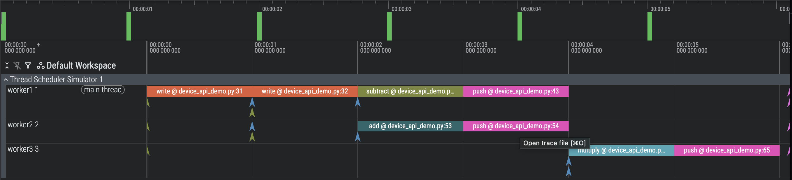

# Thread Scheduler Simulator

A Python-based multithreaded multicore device simulator that runs in a single Python thread. The simulator models multiple execution threads with various operations, tracks logical timestamps, and generates Perfetto-compatible JSON traces for visualization.

Prerequisites: Python 3.10 or newer.

## Features

- **Simulated Operations**: wait, write, push, add, multiply, subtract
- **Multicore Simulation**: Parallel execution on configurable number of cores
- **Round-robin Scheduling**: Fair scheduling among ready threads
- **Memory Model**: Address-based memory with data availability tracking
- **Logical Timestamps**: Track execution time without real-time delays; for simplicity, all operations here take 1 second, but in a real simulator, a more realistic duration would be assigned.
- **Perfetto Integration**: Generate traces viewable at [ui.perfetto.dev](https://ui.perfetto.dev)
- **Console Output**: Text-based timeline summary with efficiency statistics (based on logical times and assuming no other overheads)
- **Device API**: Simple interface for the operations supported on the simulated device (`dev.write()`, `dev.add()`, etc.)
- **Decorator-based Threads**: Simple `@sim.thread()` decorator for defining threads
- **Deadlock Detection**: Identifies when threads are permanently blocked

## Architecture

### Core Components

1. **Memory**: Simulates memory with address-based storage and availability tracking; this is a simple address-value map, unlimited capacity
2. **Thread**: Represents a simulated thread with a sequence of operations
3. **Scheduler**: Round-robin scheduler that manages thread execution
4. **Operations**: 
   - `wait(address)`: Block until data is available (can be preempted)
   - `write(address, value)`: Write data and mark as available (1s duration)
   - `push(address)`: Mark computed data as available for other threads (1s duration)
   - `add/multiply/subtract(addr1, addr2, dest)`: Math operations that compute and store results (1s each)

### Scheduling Behavior

- The scheduler uses round-robin scheduling among ready threads
- Operations run to completion except for `wait`, which blocks if data is unavailable
- Blocked threads automatically become ready when their data becomes available
- Each operation has a predetermined duration (default: 1 second)

## Installation

No external dependencies required! The simulator uses only Python standard library.

```bash
cd thread_scheduler
# Run a specific example
python3 -m examples.parallel_math

# Or run all examples
python3 examples/run_all.py
```

## Usage

### Running Examples

Run individual examples as Python modules:

```bash
# From the thread_scheduler directory
python3 -m examples.producer_consumer
python3 -m examples.multi_consumer
python3 -m examples.math_pipeline
python3 -m examples.parallel_math
python3 -m examples.statistics_pipeline
python3 -m examples.device_api_demo
python3 -m examples.deadlock_demo
```

Or run all examples at once:

```bash
python3 examples/run_all.py
```

Each example will:
1. Execute the simulation
2. Print console timeline summary with efficiency statistics
3. Generate a trace file in `traces/` subdirectory (created in current working directory)
4. Display final memory state

### Viewing Traces

1. Open [https://ui.perfetto.dev](https://ui.perfetto.dev) in your browser
2. Click "Open trace file" 
3. Select one of the generated trace files from the `traces/` directory (created in your current working directory)
4. Explore the timeline visualization showing thread execution
5. Look for the "🏁 END OF TRACE 🏁" marker to see where the simulation completes

### Creating Custom Simulations

#### Using the Device API (Recommended)

The Device API provides a clean, intuitive interface:

```python
from thread_scheduler import create_simulation, generate_perfetto_trace
from thread_scheduler.utils import print_timeline, print_memory_state

# Create simulation
sim = create_simulation(num_cores=2)
dev = sim.dev  # Get device instance

# Define threads using decorators
@sim.thread(name="host")
def host():
    return [
        dev.write("x", 42),
        dev.write("y", 10),
    ]

@sim.thread(name="worker")
def worker():
    return [
        dev.wait("x"),
        dev.wait("y"),
        dev.add("x", "y", "result"),
        dev.push("result"),
    ]

# Run simulation
events = sim.run()

# Display results
print_timeline(events, "My Simulation", num_cores=sim.get_num_cores())
generate_perfetto_trace(events, "my_trace.json")
print_memory_state(sim.get_memory())
```

#### Available Device Methods

- `dev.wait(address)` - Wait for data availability
- `dev.write(address, value)` - Write and mark available
- `dev.push(address)` - Mark computed data available
- `dev.add(addr1, addr2, dest)` - Add operation
- `dev.subtract(addr1, addr2, dest)` - Subtract operation
- `dev.multiply(addr1, addr2, dest)` - Multiply operation

All methods accept an optional `duration` parameter to customize operation time.

### Efficiency Statistics

The simulator automatically calculates and displays efficiency metrics:

- **Total work**: Sum of all operation durations (in seconds)
- **Ideal time**: Minimum possible execution time with perfect parallelism
- **Average parallelism**: Average number of cores utilized during execution
- **Efficiency**: Percentage of available cores utilized (100% = all cores busy all the time)

Example output:
```
Efficiency Statistics:
  Total work: 22.0s
  Ideal time (perfect parallelism): 5.5s
  Average parallelism: 1.83 cores
  Efficiency: 45.8% (on 4 cores)
```

## Examples

### Example 1: Simple Write/Wait

Host thread writes data, worker thread waits for it to become available.

**Note**: The `wait` operation is for synchronization - it blocks until data is available at an address, but doesn't read/return the value. Math operations (add, multiply, subtract) read from source addresses and compute results, but require an explicit `push` to make results available to other threads.

```
Time       Thread               Operation                      Status         
--------------------------------------------------------------------------------
0.0s - 1.0s host                 write('x', 42)                 completed      
0.0s       worker               wait('x')                      blocked        
1.0s - 1.0s worker               wait('x')                      completed      
```

### Example 2: Producer-Consumer

One producer writes data, two consumers wait and process it.

### Example 3: Math Pipeline

Pipeline of math operations with dependencies:
- Thread1: writes a=5, b=3
- Thread2: computes sum=a+b and pushes result
- Thread3: computes product=sum*c and pushes result

**Note**: Math operations store results but don't make them available. The `push` operation is required after each computation to make results visible to other threads.

### Example 4: Complex Dependencies - Detailed Walkthrough

This example demonstrates a complex dependency graph with multiple threads computing in parallel on a 4-core system.

#### Thread Configuration

- **Host thread**: Initializes data by writing `x=10` and `y=20`
- **Worker1 (subtract)**: Waits for x and y, then computes `diff = x - y`
- **Worker2 (add)**: Waits for x and y, then computes `sum = x + y`
- **Worker3 (multiply)**: Waits for sum and diff, then computes `result = sum * diff`

#### Execution Timeline

```
Time       Thread               Operation                      Status         
--------------------------------------------------------------------------------
0.0s - 1.0s host                 write(x, 10)                   completed      
0.0s       worker1_subtract     wait(x)                        blocked        
0.0s       worker2_add          wait(x)                        blocked        
0.0s       worker3_multiply     wait(sum)                      blocked        
1.0s - 2.0s host                 write(y, 20)                   completed      
1.0s - 1.0s worker1_subtract     wait(x)                        completed      
1.0s - 1.0s worker2_add          wait(x)                        completed      
1.0s       worker1_subtract     wait(y)                        blocked        
1.0s       worker2_add          wait(y)                        blocked        
2.0s - 2.0s worker1_subtract     wait(y)                        completed      
2.0s - 2.0s worker2_add          wait(y)                        completed      
2.0s - 3.0s worker1_subtract     subtract(x, y, diff)           completed      
2.0s - 3.0s worker2_add          add(x, y, sum)                 completed      
3.0s - 3.0s worker3_multiply     wait(sum)                      completed      
3.0s - 3.0s worker3_multiply     wait(diff)                     completed      
3.0s - 4.0s worker3_multiply     multiply(sum, diff, result)    completed      
--------------------------------------------------------------------------------
Total execution time: 4.0s
```

#### Execution Analysis

**Phase 1 (0.0s - 1.0s): Initial Write**
- Host writes `x=10` (takes 1 second)
- All worker threads attempt to start but block waiting for data
- Worker1 and Worker2 block on `wait(x)`
- Worker3 blocks on `wait(sum)` (which doesn't exist yet)

**Phase 2 (1.0s - 2.0s): Second Write & Unblocking**
- Host writes `y=20` (takes 1 second)
- Worker1 and Worker2's `wait(x)` immediately complete (data now available)
- Both workers then block on `wait(y)` since y isn't written yet

**Phase 3 (2.0s - 3.0s): Parallel Computation**
- Worker1 and Worker2's `wait(y)` immediately complete
- **Parallel execution**: Both workers run their math operations simultaneously:
  - Worker1 computes `diff = 10 - 20 = -10`
  - Worker2 computes `sum = 10 + 20 = 30`
- This demonstrates true multicore parallelism (both operations run 2.0s-3.0s)

**Phase 4 (3.0s - 4.0s): Final Computation**
- Worker3's `wait(sum)` and `wait(diff)` both complete immediately (data available)
- Worker3 computes `result = 30 * (-10) = -300`

#### Final Results
```
x = 10
y = 20
diff = -10
sum = 30
result = -300
```

#### Perfetto Visualization



The Perfetto trace clearly shows:
- **Parallel execution**: Worker1 and Worker2 operations overlap during 2.0s-3.0s
- **Dependencies**: Worker3 cannot start until both Worker1 and Worker2 complete
- **Blocking behavior**: Threads block (shown as instant events) when data isn't available
- **End marker**: The 🏁 END OF TRACE 🏁 marker appears at 4.1s on all threads

This example demonstrates how the scheduler efficiently utilizes multiple cores while respecting data dependencies between threads.

### Example 5: Advanced Parallel Statistics

A more complex example demonstrating heavy parallel computation with 10 threads on 4 cores.

Computation Pipeline:
- Initializes 4 data arrays (a, b, c, d)
- Computes pairwise operations (sum_ab, sum_cd, prod_ab, prod_cd) in parallel
- Derives statistics (diff_sums, diff_prods, total_sum, variance)
- Combines all results into final output

Features:
- Maximum parallelism with 4 cores fully utilized
- Deep dependency chains requiring careful synchronization
- Demonstrates compute-then-push pattern extensively
- Includes parallelism analysis showing core utilization

Run with: `python3 -m examples.statistics_pipeline`

Trace file: `traces/trace_statistics_pipeline.json`

### Example 6: Deadlock Detection

Demonstrates deadlock detection when two threads wait for each other.

Scenario - two threads in a circular wait:
- `worker1` waits for `data_from_worker2`
- `worker2` waits for `data_from_worker1`
- Neither can proceed, creating a deadlock

The simulator detects when all threads are blocked and issues a warning: "Deadlock detected at time X.X". Execution terminates with no operations completed. This is useful for debugging dependency issues in parallel programs.

Run with: `python3 -m examples.deadlock_demo`

Trace file: `traces/trace_deadlock_demo.json`

## Operation Reference

### wait(address)
Waits for data to be available at the specified memory address.
- **Blocks** if data is not available
- **Completes immediately** if data is available
- Can be preempted (no time passes when blocked)
- Used for synchronization between threads

### write(address, value)
Writes a value to memory and marks it as available.
- **Duration**: 1 second
- **Side effect**: Makes data available for waiting threads
- Runs to completion (cannot be preempted)
- Used for initializing data

### push(address)
Marks computed data as available without changing its value.
- **Duration**: 1 second
- **Side effect**: Makes previously computed data available for waiting threads
- Runs to completion (cannot be preempted)
- Used after math operations to publish results

### add(addr1, addr2, dest)
Adds values from two addresses and stores result to destination.
- **Duration**: 1 second
- **Formula**: `dest = memory[addr1] + memory[addr2]`
- **Important**: Result is stored but NOT made available
- Must use `push(dest)` to make result available to other threads
- Runs to completion

### multiply(addr1, addr2, dest)
Multiplies values from two addresses and stores result to destination.
- **Duration**: 1 second
- **Formula**: `dest = memory[addr1] * memory[addr2]`
- **Important**: Result is stored but NOT made available
- Must use `push(dest)` to make result available to other threads
- Runs to completion

### subtract(addr1, addr2, dest)
Subtracts second value from first and stores result to destination.
- **Duration**: 1 second
- **Formula**: `dest = memory[addr1] - memory[addr2]`
- **Important**: Result is stored but NOT made available
- Must use `push(dest)` to make result available to other threads
- Runs to completion

## Perfetto Trace Format

The simulator generates traces in the Chrome Trace Event Format, compatible with Perfetto:

- **Complete Events (X)**: Show operation duration on timeline
- **Instant Events (i)**: Mark blocked operations
- **Metadata Events (M)**: Name threads and processes
- **Time Scale**: Logical seconds converted to microseconds for visualization

Each thread appears as a separate track in the Perfetto UI, making it easy to visualize parallel execution and dependencies.

## Implementation Details

### Logical Time

The simulator uses logical time (not real-time):
- Each operation has a predetermined duration
- Time advances only when operations complete
- No actual delays or sleeps occur during simulation

### Memory Availability

Memory addresses have two states:
- **Available**: Data has been written and can be read
- **Unavailable**: No data written yet, `wait` operations will block

### Round-Robin Scheduling

The scheduler maintains a round-robin index and selects the next ready thread in circular order. This ensures fair scheduling and prevents starvation.

**Parallel Execution**: When multiple threads are ready at the same logical timestamp, they start executing simultaneously (up to the number of available cores). For example, with 4 cores, up to 4 threads can execute operations in parallel at the same logical time. The round-robin order determines which threads get scheduled first when more threads are ready than cores available.

### Deadlock Detection

The simulator detects deadlocks when all threads are either:
- Completed, or
- Blocked waiting for data that will never arrive

The `examples/deadlock_demo.py` illustrates this.

## Project Structure

```
thread_scheduler/
├── __init__.py              # Package initialization
├── simulator.py             # Core simulator (Memory, Thread, Scheduler)
├── device.py                # Device API (clean operation interface)
├── decorators.py            # Decorator-based thread creation
├── perfetto_trace.py        # Perfetto trace generation
├── utils.py                 # Utility functions (print helpers)
├── examples/                # Example simulations
│   ├── producer_consumer.py
│   ├── multi_consumer.py
│   ├── math_pipeline.py
│   ├── parallel_math.py
│   ├── statistics_pipeline.py
│   ├── device_api_demo.py
│   └── run_all.py
└── traces/                  # Generated trace files
```

## Further Reading

- [Perfetto Documentation](https://perfetto.dev/docs/)
- [Chrome Trace Event Format](https://docs.google.com/document/d/1CvAClvFfyA5R-PhYUmn5OOQtYMH4h6I0nSsKchNAySU/)

## Improvements

- Instead of generating JSON, use the Perfetto SDK
