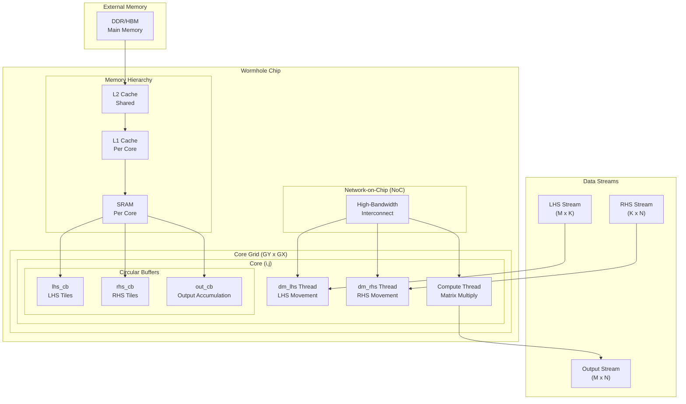
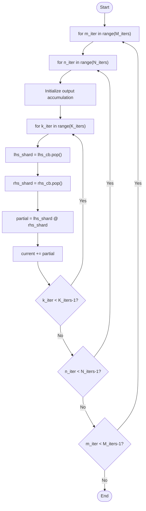

# Generalized Matrix Multiplication for Tenstorrent Wormhole Architecture

## Overview

The `custom_dm_matmul2.py` implementation provides a generalized matrix multiplication solution that can handle arbitrarily large matrices while fully utilizing the Tenstorrent Wormhole architecture. This document explains the key improvements and architectural decisions.

## Tenstorrent Tile Architecture

According to the [Tenstorrent Metalium Guide](https://github.com/tenstorrent/tt-metal/blob/main/METALIUM_GUIDE.md#native-tile-based-computing), Tenstorrent operates on **32-element tiles** as the fundamental compute unit. This native tile-based computing approach is crucial for optimal performance:

### **32-Element Tile Benefits**
- **Hardware Optimized**: Each tile is processed by specialized compute engines
- **Memory Efficient**: Tiles fit optimally in L1 cache and SRAM
- **SIMD Operations**: Vector operations on 32-element chunks
- **Network Efficiency**: Tiles are the natural unit for NoC transfers

### **Tile Alignment Strategy**
```python
# Ensure matrix dimensions are aligned to 32-element boundaries
def align_to_tile_size(dim, tile_size=32):
    return ((dim + tile_size - 1) // tile_size) * tile_size

# Example: 100x100 matrix becomes 128x128 (4x4 tiles)
M_aligned = align_to_tile_size(100)  # 128
```

## Key Improvements Over Original Implementation

### 1. **Dynamic Configuration**
- **Automatic Grid Sizing**: Calculates optimal grid dimensions based on matrix sizes
- **Adaptive Block Factors**: Determines optimal tiling based on available cores and memory
- **Scalable Architecture**: Supports matrices from 32×32 to 1024×1024 and beyond (32-element tile aligned)

### 2. **Intelligent Tiling Strategy**

```python
def calculate_optimal_block_factors(matrix_dims, grid_dims, max_tile_size=32):
    M, K, N = matrix_dims
    GY, GX = grid_dims
    
    # Distribute work across available cores
    # Tenstorrent operates on 32-element tiles as fundamental compute units
    M_block = max(1, min(M // GY, max_tile_size))
    N_block = max(1, min(N // GX, max_tile_size))
    K_block = max(1, min(K, max_tile_size))
```

**Benefits:**
- **Memory Efficient**: Respects core memory constraints
- **Load Balanced**: Distributes work evenly across cores
- **Cache Friendly**: Optimizes for L1/L2 cache utilization

### 3. **Optimal Grid Calculation**

```python
def calculate_grid_size(matrix_dims, max_cores_per_dim=8):
    M, K, N = matrix_dims
    
    # For square matrices: use square grids
    if abs(M - N) <= max(M, N) * 0.1:
        total_cores = min(M * N // (64 * 64), max_cores_per_dim * max_cores_per_dim)
        grid_size = int(math.sqrt(total_cores))
    
    # For rectangular matrices: use rectangular grids
    else:
        aspect_ratio = M / N
        # Calculate based on matrix aspect ratio
```

**Features:**
- **Aspect Ratio Aware**: Adapts grid shape to matrix shape
- **Core Utilization**: Maximizes use of available cores
- **Wormhole Optimized**: Respects architecture constraints

## Architecture Diagram



## Algorithm Flow

### 1. **Initialization Phase**
```python
# Calculate optimal configuration
matrix_dims = (M, K, N)
grid_dims = calculate_grid_size(matrix_dims, max_cores_per_dim)
block_factors = calculate_optimal_block_factors(matrix_dims, grid_dims, max_tile_size)

# Calculate iteration counts
M_iters = (M + M_block - 1) // M_block
N_iters = (N + N_block - 1) // N_block  
K_iters = (K + K_block - 1) // K_block
```

### 2. **Compute Thread Execution**


### 3. **Data Movement Patterns**

#### **LHS Data Movement (dm_lhs)**
- **Source Cores**: Leftmost column (cx == 0)
- **Target Cores**: All cores in the same row
- **Pattern**: Row-wise multicast
- **Optimization**: Single fetch, multiple recipients

#### **RHS Data Movement (dm_rhs)**
- **Source Cores**: Topmost row (cy == 0)
- **Target Cores**: All cores in the same column
- **Pattern**: Column-wise multicast
- **Optimization**: Single fetch, multiple recipients

## Performance Optimizations

### 1. **Memory Hierarchy Optimization**
- **L1 Cache**: Store frequently accessed tiles
- **L2 Cache**: Shared across cores for data reuse
- **SRAM**: Per-core storage for active computation
- **Circular Buffers**: Double buffering for smooth execution

### 2. **Network-on-Chip Utilization**
- **Multicast Operations**: Efficient data distribution
- **Pipelined Transfers**: Overlap computation and communication
- **Bandwidth Optimization**: Minimize redundant transfers

### 3. **Load Balancing**
- **Dynamic Tiling**: Adapts to matrix dimensions
- **Core Utilization**: Maximizes parallel execution
- **Memory Distribution**: Even load across cores

## Scalability Features

### 1. **Multi-Chip Support**
```python
# Future extension for multi-chip scaling
def calculate_multi_chip_grid(total_cores, chips_available):
    cores_per_chip = total_cores // chips_available
    return distribute_cores_across_chips(cores_per_chip, chips_available)
```

### 2. **Memory Scaling**
- **Hierarchical Memory**: L1 → L2 → HBM → DDR
- **Data Streaming**: Continuous data flow
- **Cache Coherence**: Efficient data sharing

### 3. **Compute Scaling**
- **Spatial Parallelism**: Multiple cores working simultaneously
- **Temporal Parallelism**: Pipelined execution
- **Instruction Parallelism**: SIMD operations within cores

## Test Cases

The implementation includes comprehensive test cases:

### **Matrix Size Categories**
1. **Small (32×32, 64×64)**: Single core optimization with 32-element tiles
2. **Medium (128×128, 256×256)**: Multi-core utilization
3. **Large (512×512)**: Full grid utilization
4. **Very Large (1024×1024)**: Maximum scaling
5. **Rectangular**: Aspect ratio optimization (32-element aligned)
6. **Extreme Aspect Ratios**: Edge case handling (32-element aligned)

### **Performance Metrics**
- **Frobenius Relative Error**: Matrix-specific accuracy
- **L2 Relative Error**: Alternative accuracy measure
- **Absolute Error**: Raw difference magnitude
- **PCC (Pearson Correlation Coefficient)**: Statistical validation

## Usage Examples

### **Basic Usage**
```python
# Automatic configuration
lhs = torch.randn(512, 256)
rhs = torch.randn(256, 1024)
out = torch.zeros(512, 1024)

generalized_matmul(lhs, rhs, out)
```

### **Custom Configuration**
```python
# Manual configuration
grid_dims = (4, 4)
block_factors = [(32, 16), (16, 64), (32, 64)]

generalized_matmul(lhs, rhs, out, block_factors, grid_dims)
```

### **Performance Testing**
```python
# Comprehensive testing
run_matmul_test(1024, 1024, 1024, max_cores_per_dim=8, max_tile_size=128)
```

## Future Enhancements

### 1. **Multi-Chip Scaling**
- Automatic chip detection and utilization
- Inter-chip communication optimization
- Load balancing across multiple chips

### 2. **Advanced Optimizations**
- **Mixed Precision**: FP16/FP32 optimization
- **Sparse Matrices**: Sparse matrix support
- **Batch Operations**: Multiple matrix multiplication

### 3. **Compiler Integration**
- **Auto-Tuning**: Automatic parameter optimization
- **Profile-Guided**: Runtime performance feedback
- **JIT Compilation**: Just-in-time optimization

## Conclusion

The generalized matrix multiplication implementation provides:

- **Scalability**: Handles matrices from 64×64 to 1024×1024+
- **Efficiency**: Optimal core and memory utilization
- **Flexibility**: Automatic and manual configuration options
- **Robustness**: Comprehensive error checking and validation
- **Performance**: Wormhole architecture optimization

This implementation serves as a foundation for high-performance matrix operations on the Tenstorrent Wormhole architecture, enabling efficient computation of arbitrarily large matrices while maximizing hardware utilization.

